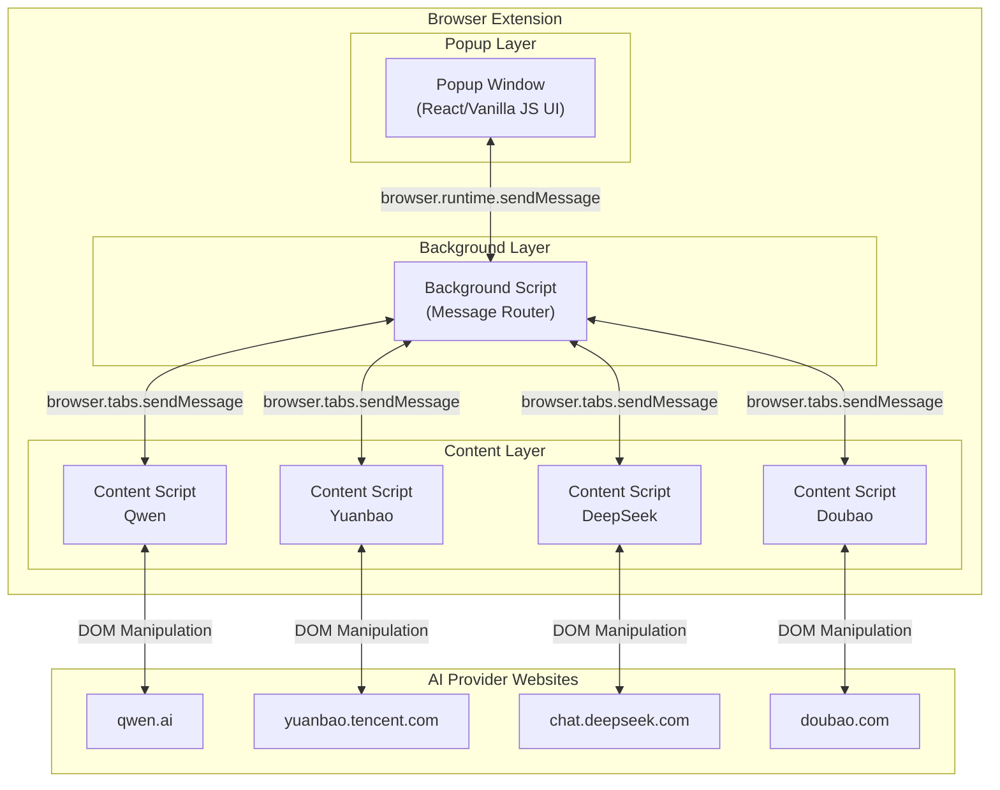
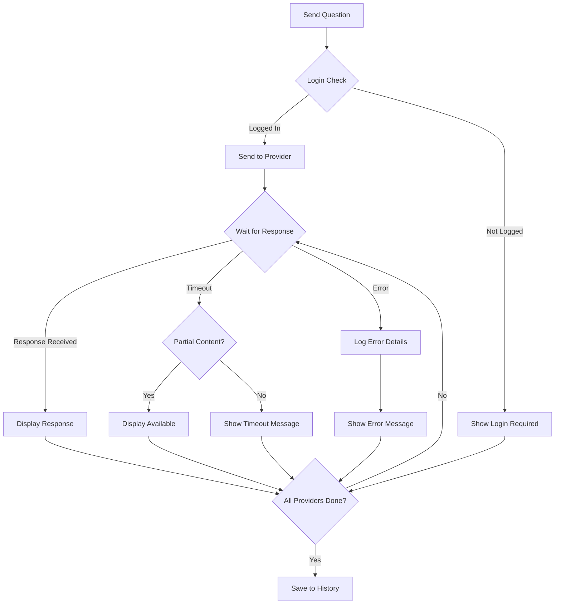

# Multi-AI Unified Query Browser Extension

Feature Name: multi-ai-unified-query
Created: 2026-04-17

## Description

A browser extension that provides a unified interface for querying multiple AI platforms simultaneously. Users enter a question once and receive responses from Qwen, Yuanbao (Tencent), DeepSeek, and Doubao (ByteDance) in a side-by-side layout.

## Architecture



## Components and Interfaces

### 1. Popup Window

**File:** `src/popup/popup.html`, `src/popup/popup.js`, `src/popup/popup.css`

**Responsibilities:**
- Render the main user interface
- Collect user input (question text)
- Display AI responses in grid layout
- Show provider status indicators
- Handle user interactions (send button, settings, history)

**Public API (via Chrome Messaging):**

| Message Type | Direction | Payload |
|--------------|-----------|---------|
| `SEND_QUESTION` | Popup → Background | `{ question: string }` |
| `QUESTION_SENT` | Background → Popup | `{ success: boolean, providers: string[] }` |
| `AI_RESPONSE` | Background → Popup | `{ provider: string, content: string, status: string }` |
| `ALL_RESPONSES_COMPLETE` | Background → Popup | `{ conversationId: string }` |
| `GET_HISTORY` | Popup → Background | `{}` |
| `HISTORY_RESPONSE` | Background → Popup | `{ conversations: Conversation[] }` |
| `GET_SETTINGS` | Popup → Background | `{}` |
| `SETTINGS_RESPONSE` | Background → Popup | `{ settings: Settings }` |
| `UPDATE_SETTINGS` | Popup → Background | `{ settings: Settings }` |

### 2. Background Script

**File:** `src/background/background.js`

**Responsibilities:**
- Act as message hub between Popup and Content Scripts
- Manage active conversations and state
- Coordinate parallel requests to multiple providers
- Persist conversations to Chrome Storage
- Handle timeout management

**Public API (Chrome Messaging):**

| Message Type | Direction | Payload |
|--------------|-----------|---------|
| `SEND_QUESTION` | Popup → Background | `{ question: string }` |
| `FORWARD_TO_PROVIDER` | Background → Content Script | `{ provider: string, question: string, conversationId: string }` |
| `PROVIDER_RESPONSE` | Content Script → Background | `{ provider: string, content: string, status: string, conversationId: string }` |
| `SAVE_CONVERSATION` | Background (internal) | `{ conversation: Conversation }` |

**State Management:**
```javascript
{
  activeConversations: Map<string, Conversation>,
  pendingProviders: Map<string, Set<string>>,
  providerTimeouts: Map<string, number>
}
```

### 3. Content Scripts

**Files:** 
- `src/content-scripts/qwen.js`
- `src/content-scripts/yuanbao.js`
- `src/content-scripts/deepseek.js`
- `src/content-scripts/doubao.js`

**Common Interface:**

| Method | Description |
|--------|-------------|
| `injectAndSubmit(question)` | Inject automation script to submit question |
| `extractResponse()` | Extract response from page DOM |
| `checkLoginStatus()` | Verify if user is logged in |
| `waitForResponse(timeout)` | Wait for AI response with timeout |

**Provider-Specific Implementation:**

| Provider | URL Pattern | DOM Selectors (approximate) |
|----------|-------------|----------------------------|
| Qwen | `*://qwen.ai/*` or `*://qwen.cn/*` | Input selector, submit button, response container |
| Yuanbao | `*://yuanbao.tencent.com/*` | Input selector, submit button, response container |
| DeepSeek | `*://chat.deepseek.com/*` | Input selector, submit button, response container |
| Doubao | `*://doubao.com/*` | Input selector, submit button, response container |

**Message Format (Content Script ↔ Background):**
```javascript
// To Background
{ type: 'PROVIDER_RESPONSE', provider: 'qwen', content: '...', status: 'success', conversationId: '...' }

// From Background  
{ type: 'FORWARD_TO_PROVIDER', provider: 'qwen', question: '...', conversationId: '...' }
```

### 4. Shared Utilities

**File:** `src/utils/markdown-renderer.js`

**Responsibilities:**
- Parse and render Markdown to HTML
- Apply syntax highlighting to code blocks
- Handle table formatting

**Dependencies:**
- Marked.js (Markdown parser)
- Highlight.js (Code syntax highlighting)

## Data Models

### Conversation

```javascript
{
  id: string,                    // UUID v4
  timestamp: string,              // ISO 8601 format
  question: string,               // User's question text
  responses: Response[]           // Array of AI responses
}
```

### Response

```javascript
{
  provider: 'qwen' | 'yuanbao' | 'deepseek' | 'doubao',
  content: string,                // Rendered Markdown content
  rawContent: string,             // Original response text
  status: 'success' | 'error' | 'timeout' | 'login_required',
  timestamp: string               // ISO 8601 format
}
```

### Settings

```javascript
{
  enabledProviders: ['qwen', 'yuanbao', 'deepseek', 'doubao'],
  timeoutSeconds: number,         // Default: 30, Range: 10-60
  autoSaveHistory: boolean         // Default: true
}
```

### ProviderStatus

```javascript
{
  provider: string,
  status: 'ready' | 'busy' | 'error' | 'not_logged_in' | 'disconnected',
  lastError?: string
}
```

## Correctness Properties

### Invariants

1. **Single Submission**: A question submitted by the user SHALL be sent exactly once to each enabled provider
2. **Response Binding**: Each response displayed in the UI SHALL correspond to the correct question that triggered it
3. **History Integrity**: Saved conversations SHALL contain the exact question and responses that were exchanged
4. **Settings Persistence**: User settings SHALL be preserved across browser sessions

### Constraints

1. **Maximum Providers**: The system SHALL support at most 10 providers simultaneously
2. **Response Timeout**: Default timeout is 30 seconds, configurable between 10-60 seconds
3. **History Limit**: Maximum 100 conversations stored; oldest are automatically removed when limit exceeded
4. **Question Length**: Maximum question length is 10,000 characters

### Concurrency Rules

1. **Parallel Execution**: Questions to different providers SHALL be sent in parallel, not sequentially
2. **No Race Conditions**: When multiple responses arrive simultaneously, the UI SHALL render all without flickering or data loss
3. **Cancellation**: User can cancel pending requests; cancellation SHALL stop all in-flight requests

## Error Handling

### Error Categories and Responses

| Error Category | User-Facing Message | Technical Handling |
|----------------|---------------------|-------------------|
| Network Error | "网络连接失败，请检查网络" | Retry up to 3 times with exponential backoff |
| Provider Timeout | "AI响应超时" | Display partial content if available |
| Not Logged In | "请先登录{Provider}" | Show login link button |
| DOM Injection Failed | "无法连接到此AI，请刷新页面" | Suggest user refresh the target page |
| Storage Full | "存储空间不足，请清理历史记录" | Prompt user to delete old conversations |
| Markdown Render Error | (fallback to plain text) | Log error, show raw text |

### Error Recovery Flow



## Browser Compatibility

### Target Browsers

| Browser | Minimum Version | Notes |
|---------|----------------|-------|
| Chrome | 120+ | Primary target |
| Edge | 120+ | Chromium-based, full support |
| Opera | 100+ | Chromium-based |
| Firefox | 115+ | Secondary target, uses WebExtensions API |

### Permissions Required

```json
{
  "permissions": [
    "activeTab",
    "storage"
  ],
  "host_permissions": [
    "https://qwen.ai/*",
    "https://qwen.cn/*",
    "https://yuanbao.tencent.com/*",
    "https://chat.deepseek.com/*",
    "https://doubao.com/*"
  ]
}
```

## File Structure

```
multi-ai-extension/
├── manifest.json              # Extension manifest v3
├── popup/
│   ├── popup.html             # Main UI HTML
│   ├── popup.js               # Popup logic
│   ├── popup.css              # Popup styles
│   ├── components/
│   │   ├── Header.js          # Header component
│   │   ├── QuestionInput.js   # Question input component
│   │   ├── ResponseGrid.js    # Response grid component
│   │   ├── StatusBar.js       # Provider status bar
│   │   ├── HistoryPanel.js    # History panel component
│   │   └── SettingsPanel.js   # Settings panel component
│   └── index.js               # Popup entry point
├── background/
│   ├── background.js          # Background script entry
│   ├── messageRouter.js       # Message routing logic
│   ├── conversationManager.js # Conversation state management
│   └── storageManager.js      # Chrome Storage wrapper
├── content-scripts/
│   ├── base.js                # Base class for content scripts
│   ├── qwen.js                # Qwen provider implementation
│   ├── yuanbao.js             # Yuanbao provider implementation
│   ├── deepseek.js            # DeepSeek provider implementation
│   └── doubao.js              # Doubao provider implementation
├── utils/
│   ├── markdown-renderer.js    # Markdown rendering utility
│   ├── logger.js              # Logging utility
│   └── constants.js           # Shared constants
├── assets/
│   ├── icons/                 # Extension icons
│   └── provider-logos/        # AI provider logos
└── tests/
    ├── unit/
    │   ├── markdown-renderer.test.js
    │   ├── storage-manager.test.js
    │   └── message-router.test.js
    └── integration/
        └── popup-background.test.js
```

## Implementation Notes

### Content Script Injection Strategy

Due to the dynamic nature of AI provider websites, content scripts use a two-phase injection approach:

1. **Manifest Declaration**: Content scripts are declared in `manifest.json` with specific URL patterns
2. **Runtime Injection**: For sites that require login or have complex SPAs, scripts verify DOM readiness before automation

### DOM Automation Pattern

Each content script implements the following pattern:

```javascript
class BaseProvider {
    async injectAndSubmit(question) {
        // 1. Wait for input element to be ready
        await this.waitForSelector(this.selectors.input);
        
        // 2. Type question into input
        await this.typeText(this.selectors.input, question);
        
        // 3. Click submit button
        await this.click(this.selectors.submit);
        
        // 4. Wait for response
        await this.waitForResponse();
        
        // 5. Extract and return response
        return this.extractResponse();
    }
}
```

### Message Channel for Cross-Tab Communication

When multiple tabs have AI provider pages open, the background script uses tab ID to route messages to the correct content script instance.

## Test Strategy

### Unit Tests

| Component | Test Cases |
|-----------|-----------|
| Markdown Renderer | Heading levels, bold/italic, code blocks, tables, lists, links |
| Storage Manager | Save, retrieve, delete, handle quota errors |
| Message Router | Correct routing, error handling, timeout management |

### Integration Tests

| Scenario | Expected Result |
|----------|-----------------|
| Send question with all providers ready | All providers receive and respond |
| One provider times out | Other providers still display, timeout shown for timed-out provider |
| User not logged in to one provider | Login required message shown, other providers continue |
| User cancels mid-request | All pending requests cancelled, partial results cleared |

### Manual Test Checklist

- [ ] Extension installs without errors
- [ ] Popup opens on icon click
- [ ] Question input accepts multi-line text
- [ ] Ctrl+Enter submits question
- [ ] All 4 providers receive question
- [ ] Responses display in grid layout
- [ ] Markdown renders correctly (headers, code, tables)
- [ ] Provider status indicators update correctly
- [ ] History saves automatically after completion
- [ ] History panel shows past conversations
- [ ] Settings changes persist after reload
- [ ] Extension works in Chrome, Edge, Firefox

## References

[^1]: (Chrome Extensions Documentation) - [Chrome Extension Development](https://developer.chrome.com/docs/extensions/mv3/)
[^2]: (MDN WebExtensions) - [Browser Extensions](https://developer.mozilla.org/en-US/docs/Mozilla/Add-ons/WebExtensions)
[^3]: (Marked.js) - [Markdown Parser](https://marked.js.org/)
[^4]: (Highlight.js) - [Syntax Highlighting](https://highlightjs.org/)
